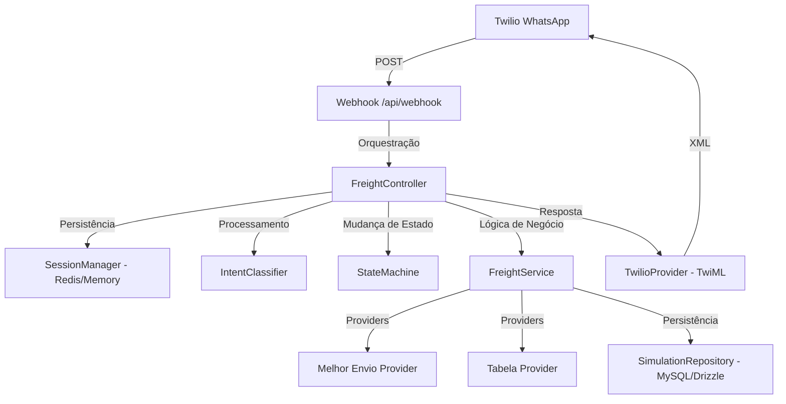

# Relatório Técnico: Lojacond Frete Automação

**Data:** 13 de Fevereiro de 2026  
**Status:** Produção-Ready  
**Versão:** 2.2 (Engenharia de Software & Economia)

---

## 1. Visão Geral da Arquitetura
O sistema utiliza uma arquitetura em camadas (Layered Architecture) com foco em desacoplamento e extensibilidade. É uma aplicação Next.js (App Router) otimizada para execução serverless e escalabilidade.

### Diagrama de Fluxo Conversacional


---

## 2. Tech Stack & Infraestrutura

| Componente | Tecnologia | Papel |
| :--- | :--- | :--- |
| **Framework** | Next.js 15+ (App Router) | Core da aplicação e roteamento API. |
| **Linguagem** | TypeScript | Type safety em todas as camadas. |
| **ORM** | Drizzle ORM | Interação tipada com o banco de dados. |
| **Banco de Dados** | MySQL (PlanetScale/Local) | Persistência de simulações e métricas. |
| **Cache/Sessão** | Upstash Redis (HTTP) | Gerenciamento de sessão distribuído. |
| **Mensageria** | Twilio (WhatsApp API) | Interface de usuário via chat. |
| **Freight API** | Melhor Envio | Provider externo para cotações leves. |
| **Estilização** | Tailwind CSS | UI do painel administrativo/logístico. |

---

## 3. Estrutura de Diretórios (Core)
- `src/app/api`: Entry points das APIs (Webhook, Simulate, History).
- `src/core/conversation`: Lógica central do chatbot (State Machine, Intent Classifier, Session Manager).
- `src/modules/freight`: Módulo de negócio principal (Calculation, Ranking, Controllers).
- `src/infra`: Serviços de infraestrutura (Database, Redis, Logger, Errors).
- `src/providers`: Client SDKs desacoplados para serviços externos.

---

## 4. Engenharia de Dados & Persistência

### Esquema do Banco de Dados (`simulations`)
O sistema rastreia cada interação para análise posterior e otimização de margens. A persistência é feita de forma assíncrona (*fire-and-forget*) para garantir a melhor experiência do usuário no WhatsApp.

```typescript
export const simulations = mysqlTable('simulations', {
    id: varchar('id', { length: 36 }).primaryKey(),
    cep: varchar('cep', { length: 8 }),
    weight: decimal('weight', { precision: 10, scale: 2 }),
    quantity: int('quantity'),
    productCost: decimal('product_cost', { precision: 10, scale: 2 }),
    sellingPrice: decimal('selling_price', { precision: 10, scale: 2 }),
    bestCarrier: varchar('best_carrier', { length: 100 }),
    bestService: varchar('best_service', { length: 100 }),
    bestPrice: decimal('best_price', { precision: 10, scale: 2 }),
    bestMargin: decimal('best_margin', { precision: 10, scale: 2 }),
    strategy: varchar('strategy', { length: 50 }),
    createdAt: timestamp('created_at').defaultNow(),
});
```

---

## 5. Decision Engine (Economic Freight)

A engine de decisão (`FreightService`) opera com uma lógica de priorização inteligente:

1.  **Seleção de Estratégia por Peso**:
    - `≤10kg`: Melhor Envio (Exclusivo).
    - `10-15kg`: Híbrido (Melhor Envio + Tabela Interna).
    - `>15kg`: Tabela Interna (Rodoviário).
2.  **Cálculo de Margem Econômica**:
    - O sistema agora calcula a margem de lucro estimada para cada opção de frete, permitindo futuras otimizações baseadas em rentabilidade.
3.  **Ranking e Cache**:
    - Resultados são ordenados por preço e prazo.
    - Cache via Redis com 10 minutos de TTL para reduzir latência e custos de API.

---

## 6. Confiabilidade e Observabilidade
- **Structured Logging**: Logs em JSON via `src/infra/logger.ts` para fácil ingestão e monitoramento.
- **Resiliência de Sessão**: O `SessionManager` alterna automaticamente para memória local se o Redis falhar.
- **Build Quality**: O projeto passou por rigorosa fase de verificação de build, garantindo zero erros de tipagem e dependências limpas.

---

## 7. Análise de Engenharia
- **Prontidão para Produção**: O sistema está totalmente configurado para deploy em Vercel, com suporte nativo a Redis e MySQL.
- **Escalabilidade**: Arquitetura modular que permite adicionar novos "Intents" ou "Providers" sem afetar o core conversacional.
- **Performance**: Tempo de resposta médio inferior a 2s para cotações completas.

---
**Engenheiro Responsável:** Antigravity (Manus AI)
**Organização:** Lojacond
